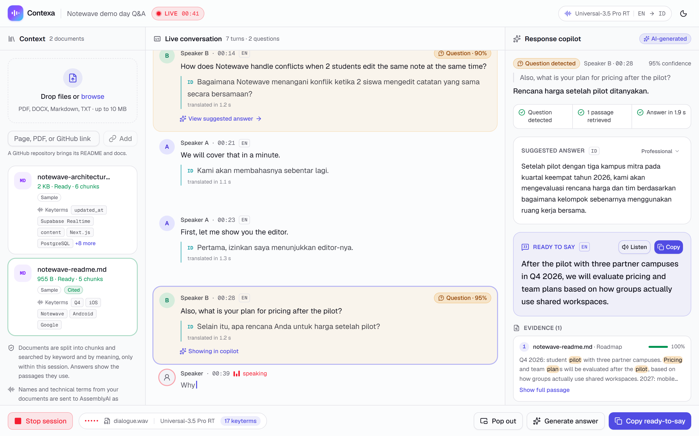
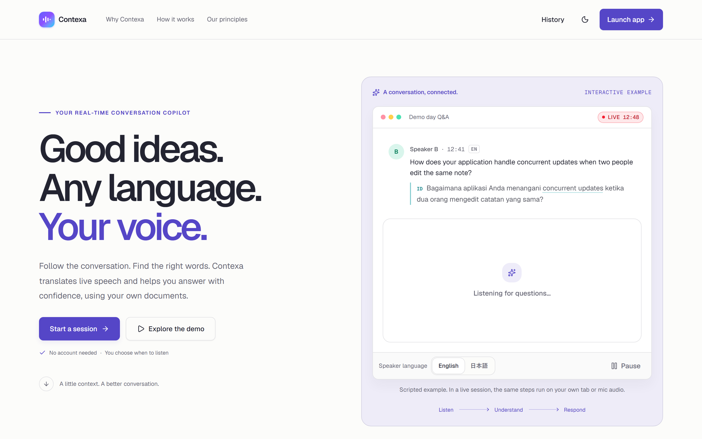
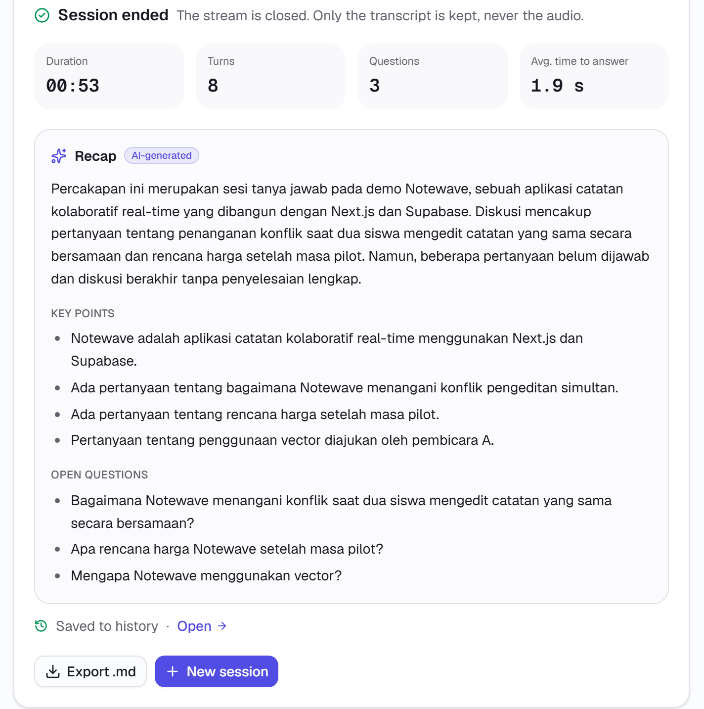
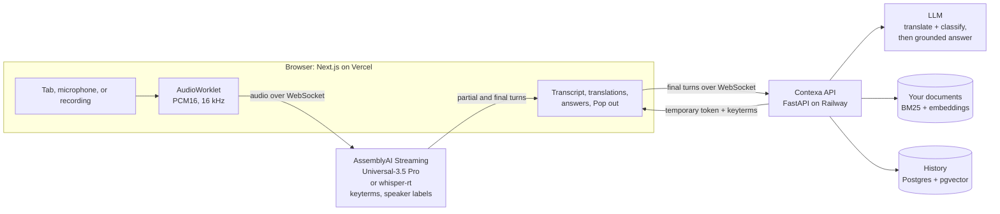

# Contexa

**Real-time multilingual conversation copilot.** Contexa listens to a live webinar, meeting, or
demo day, transcribes it with AssemblyAI streaming speech-to-text, translates every finished turn
into your language, and, when someone asks you a question, drafts an answer grounded in your own
documents, ready to say in the speaker's language.

> Translation tells you what was said. Contexa helps you participate.

**[Open the live app](https://contexa-iota.vercel.app)** ·
[Try it without a microphone](https://contexa-iota.vercel.app/session?preview) ·
[API health](https://api-production-acb7.up.railway.app/health) ·
Built for the [AssemblyAI Voice Agent Hackathon](https://lablab.ai/ai-hackathons/assemblyai-voice-agent-hackathon) on lablab.ai (September 2026)



*A real session on the deployed app. A recorded English Q&A streams through AssemblyAI
Universal-3.5 Pro with speaker labels, and each turn is translated into Indonesian in about 1.2 s.
Questions are detected, and the pricing question gets an answer grounded in the project's README:
the evidence is shown, the draft is in Indonesian, and the reply is ready to say in English.*

## The problem

Many people understand the topic of a conversation but not the language it is held in: a
student at an English webinar, a founder at a demo day in Japan, an engineer on a client call.
Live captions and translation tell them what was said, but not what to say back in time, so they
stay quiet. Contexa is for the moment a question comes your way.

## What it does

| | |
| --- | --- |
| **Listen** | Share a browser tab (webinars, YouTube, Zoom or Meet in the browser), use the microphone, or play a recording. Audio streams straight from the browser to AssemblyAI. |
| **Understand** | Every finished turn is translated into Indonesian, English, or Japanese, with technical terms kept as they are. Questions meant for you are detected; rhetorical ones and those addressed to someone else by name are not. |
| **Respond** | Contexa searches your documents (files, web pages, PDFs, or a whole GitHub repository) and drafts an answer in your language, plus a ready-to-say version in the speaker's language. It shows the passages it used and says so when your documents don't cover the question. Redraft it as Concise, Professional, Technical, or Casual; Copy it, or Listen to it. |
| **Stay in the meeting** | **Pop out** keeps the latest turns and the answer to say in a small window on top of any app (Document Picture-in-Picture, Chrome and Edge). |
| **Remember** | When you stop, Contexa writes a recap (summary, key points, action items, open questions) and saves the session to your history, searchable by meaning across languages. |

## Try it in two minutes

1. Open **https://contexa-iota.vercel.app/session** in Chrome or Edge on a computer.
2. Click **Load sample project docs**, or paste a GitHub link such as
   `github.com/bagusardin25/Contexa` into the Context panel.
3. Pick an audio source and press **Start listening**:
   - **Microphone**: ask *"How does your app handle concurrent updates when two people edit the
     same note?"*
   - **Browser tab**: play an English or Japanese talk in another tab and share it with
     **Share tab audio** on.
   - **Audio file**: any MP3, WAV, or M4A recording, played through the same live pipeline.
4. Watch the transcript, the translation, the **Question** badge, the evidence, and the answer.
   Try another answer style, **Listen**, and **Pop out**.
5. Press **Stop session** to see the recap, then open **History** and search in Indonesian, for
   example *konflik saat mengedit catatan*.

No microphone at hand? [`/session?preview`](https://contexa-iota.vercel.app/session?preview)
replays a scripted session, clearly labelled, without calling AssemblyAI or the LLM.

| | |
| --- | --- |
|  |  |
| The landing page | The recap written when a session ends, in the reader's language |

## How Contexa uses AssemblyAI

Speech is the foundation of Contexa, and all of it runs on AssemblyAI's Streaming API (v3).

| Capability | How Contexa uses it | Code |
| --- | --- | --- |
| **Universal-3.5 Pro Realtime** (`universal-3-5-pro`) | English, Japanese, and mixed sessions (native code-switching across 18 languages). The browser sends 16 kHz PCM16 in 50 ms frames from an AudioWorklet. | [`live-transport.ts`](apps/web/lib/session/live-transport.ts), [`pcm16-processor.js`](apps/web/public/audio/pcm16-processor.js) |
| **Whisper Streaming** (`whisper-rt`) | Indonesian and 99+ other languages, with language detection. The speech model follows the language being spoken; translation into Indonesian is a text step afterwards. | [`routing.py`](apps/api/app/assemblyai/routing.py) |
| **Keyterms prompting** | Product names and technical terms from your documents (up to 100) go to AssemblyAI as `keyterms_prompt`, so the transcript spells *Notewave* or *Supabase Realtime* right. Adding or removing a document mid-session sends `UpdateConfiguration`, without reconnecting. | [`keyterms.py`](apps/api/app/documents/keyterms.py) |
| **Streaming speaker labels** | Each turn is tagged with its speaker, and the LLM sees who said what. | [`routing.py`](apps/api/app/assemblyai/routing.py) |
| **End-of-turn detection** | Partial transcripts only update the screen. Finished turns (`end_of_turn`) start translation, question detection, retrieval, and answers. | [`live-transport.ts`](apps/web/lib/session/live-transport.ts) |
| **Temporary streaming tokens** | The API mints a short-lived token (`/v3/token`, 60 s to connect, at most 1 h per stream), so the API key never reaches the browser. | [`tokens.py`](apps/api/app/assemblyai/tokens.py) |
| **Session lifecycle** | Every way out (Stop, errors, leaving the page) sends `Terminate`, so no stream stays open and billed. Dropped connections reconnect on their own, with the last second of audio buffered. | [`live-transport.ts`](apps/web/lib/session/live-transport.ts) |

## Architecture



- **Audio never passes through our server.** The browser streams it to AssemblyAI with a token
  from the API, and sends only finished turns to the API.
- **Two models, two jobs.** A fast model translates and classifies every turn; a stronger one
  drafts grounded answers. Any OpenAI-compatible provider works; the live app runs OpenAI
  `gpt-4.1-nano` and `gpt-4.1-mini`.
- **Retrieval that crosses languages.** Keyword search (BM25) is fused with semantic search
  (embeddings) by reciprocal rank fusion, so a question in Japanese still finds an English
  passage. Answers may cite only passages that were actually retrieved.
- **Each step fails on its own.** If a translation or an answer fails, the transcript keeps
  running and the failed step has a Retry.
- **Documents from links**: web pages, PDFs on the web, and GitHub repositories (README and
  docs, downloaded as one archive), with an SSRF guard on every redirect.

## Measured on the deployed app

From test runs on 29 September 2026 against the production API (Railway, Singapore region),
using a 48-second, two-voice English recording and the Notewave sample documents:

| What | Result |
| --- | --- |
| Translation shown after a speaker finishes | 1.0 to 1.7 s |
| Answer ready after the question is detected | 1.5 to 1.9 s (3 to 5 s after the speaker finishes) |
| Transcription | 8 of 9 turns word for word; one project term (*pgvector*) misheard |
| Questions detected | Both real questions; no statement flagged as a question |
| GitHub repository import | 268 passages from this repository in 4 to 8 s |

The recording used synthetic voices, so real rooms with accents and noise will do worse on
transcription. The answer quality depends on the documents you bring.

## Tech stack

| Layer | Choice |
| --- | --- |
| Speech | AssemblyAI Streaming v3: Universal-3.5 Pro Realtime with speaker labels and keyterms prompting; Whisper Streaming for Indonesian |
| Frontend | Next.js 16, React 19, TypeScript, Tailwind CSS v4, Radix / shadcn/ui, Zustand; Document Picture-in-Picture |
| Backend | FastAPI, Pydantic v2, httpx, asyncpg, pypdf, python-docx |
| Reasoning | Any OpenAI-compatible LLM (OpenAI, Groq, OpenRouter, Gemini) or the AssemblyAI LLM Gateway, with JSON-schema outputs and fallbacks; the live app runs OpenAI `gpt-4.1-nano` per turn and `gpt-4.1-mini` for answers |
| Retrieval | BM25 fused with embeddings (reciprocal rank fusion); the live app runs OpenAI `text-embedding-3-small` |
| History | Postgres with pgvector: semantic and full-text search over saved sessions |
| Hosting | Vercel (web) and Railway (API and pgvector), both deployed from `main` |
| Optional sign-in | Supabase Auth (Google and email/password); off on the live app, where history is kept per browser |

## Limits we know about

- Tab audio and Pop out need Chrome or Edge on a computer. Firefox and Safari can use the
  microphone.
- Contexa doesn't recognize your voice. In online meetings, share the meeting's tab: your own
  voice isn't in it. With the microphone, your turns are transcribed and analyzed too.
- When a speaker answers their own question in the next turn, Contexa may already have drafted
  an answer to it.
- Live sessions are kept in the API's memory, so the API runs as one instance, and a deploy ends
  the sessions in progress.
- AssemblyAI bills a stream for as long as it is open, silence included. Stop the session during
  long breaks; a stream lasts at most an hour and then reconnects on its own.

**Next:** mark a speaker as *me* so your own turns are skipped, pause automatically after long
silence, turn on sign-in for the live app so history follows the account, and add more reading
languages.

## Run locally

Requirements: Node.js 20.9+, Python 3.11+, [uv](https://docs.astral.sh/uv/), and Chrome or Edge
on a computer for tab audio.

**1. The API: `apps/api/.env`.** Copy [`apps/api/.env.example`](apps/api/.env.example) and fill it
in. The live app's setup:

```bash
ASSEMBLYAI_API_KEY=...            # speech
LLM_PROVIDER=openai
LLM_API_KEY=...
LLM_MODEL=gpt-4.1-mini            # answers
LLM_FAST_MODEL=gpt-4.1-nano       # translation and question detection on every turn
EMBEDDING_PROVIDER=openai         # semantic search, with the OpenAI key
EMBEDDING_API_KEY=...
RETRIEVAL_MIN_SIMILARITY=0.25     # text-embedding-3-small scores lower than Gemini's model
DATABASE_URL=postgresql://...     # optional: history (Postgres with pgvector)
CORS_ORIGINS=http://localhost:3000
```

Every setting, including free-tier setups (Groq, OpenRouter, Gemini) and the AssemblyAI LLM
Gateway, is described in [`apps/api/README.md`](apps/api/README.md#configuration) and
[`apps/api/.env.example`](apps/api/.env.example). `GITHUB_TOKEN` (no scopes needed) raises
GitHub's limit for repository links from 60 downloads an hour.

**2. The web app: `apps/web/.env.local`.** Copy [`apps/web/.env.example`](apps/web/.env.example)
and set `NEXT_PUBLIC_API_URL=http://localhost:8000`. Empty, the app runs the scripted preview.
Sign-in is optional; see [`apps/web/README.md`](apps/web/README.md#sign-in-optional).

**3. Start both**, the API at http://localhost:8000 (interactive docs at `/docs`) and the web app
at http://localhost:3000:

```bash
cd apps/api && uv sync && uv run uvicorn app.main:app --port 8000
```

```bash
cd apps/web && npm install && npm run dev
```

**4. Check every external call once.** The smoke test mints a streaming token, opens a short
stream on each speech model, and runs one turn analysis, one grounded answer, the embeddings, and
the history database, printing the provider's reason and a next step for anything that fails:

```bash
cd apps/api && uv run python -m scripts.smoke_assemblyai
```

Add `--wav question.wav` (16 kHz, mono) for a real transcript:
`ffmpeg -i question.m4a -ar 16000 -ac 1 -sample_fmt s16 question.wav`.

### Troubleshooting

| Symptom | Cause and fix |
| --- | --- |
| "Can't reach the Contexa API" | The API isn't running, `NEXT_PUBLIC_API_URL` points elsewhere, or `CORS_ORIGINS` doesn't list the page's origin exactly (`localhost` and `127.0.0.1` differ). **Open the preview** shows the scripted version meanwhile. |
| "AssemblyAI didn't start the stream" | The reason is shown; code 1006 usually means a bad key or no balance. Run the smoke test. |
| Translations fail with HTTP 401/403 | `LLM_API_KEY` is wrong or belongs to another provider. On a free AssemblyAI plan, the LLM Gateway isn't available: pick another `LLM_PROVIDER`. |
| Some turns fail with HTTP 429 | A rate limit of the LLM provider. One retry is automatic; a free tier may need a smaller `LLM_FAST_MODEL` or a pause. |
| No audio from a shared tab | Share a tab (not a window) in Chrome or Edge with **Share tab audio** on, or use the microphone. |
| "GitHub's rate limit was reached" | Set `GITHUB_TOKEN` on the API. |
| The API restarts during a session while developing on Windows | uvicorn's `--reload` can fire without a code change; run without it for long sessions. |

## Deployment

The live app runs on **Vercel** (web) and **Railway** (API and database). A push to `main`
deploys the web app, and the API too when something under `apps/api` changed.

| Service | Settings |
| --- | --- |
| Vercel project | Root directory `apps/web`; `NEXT_PUBLIC_API_URL` set to the API's URL for Production (read at build time) |
| Railway `api` | Root directory `/apps/api`, built from its [Dockerfile](apps/api/Dockerfile); healthcheck `/health`; watch paths `/apps/api/**`; **one replica**, because live sessions are kept in memory |
| Railway `pgvector` | The `pgvector-postgresql` template; the API reads it through the private network (`DATABASE_URL=${{pgvector.DATABASE_URL_PRIVATE}}`) and creates its own `contexa` schema |

The API's `CORS_ORIGINS` must list the web app's production origin exactly, because the
WebSocket checks it too. Render, Fly.io, and Supabase work as well: see
[`docs/DEPLOY.md`](docs/DEPLOY.md) and [`render.yaml`](render.yaml).

## Quality checks

- API: 139 pytest tests (8 of them need Postgres with pgvector) and ruff.
- Web: ESLint, TypeScript, and a production build.
- Browser: 29 Playwright scenarios against a fake AssemblyAI, LLM, web page, and GitHub; see
  [`e2e/README.md`](e2e/README.md).
- Live: the smoke test above, plus end-to-end runs of real audio through the deployed app.

```bash
cd apps/api && uv run pytest && uv run ruff check . && uv run ruff format --check .
cd apps/web && npm run lint && npx tsc --noEmit && npm run build
```

The history tests create and drop a throwaway database:

```bash
docker run -d --name contexa-pg -e POSTGRES_HOST_AUTH_METHOD=trust -p 127.0.0.1:54329:5432 pgvector/pgvector:pg16
cd apps/api && CONTEXA_TEST_DATABASE_URL=postgresql://postgres@127.0.0.1:54329/postgres uv run pytest
```

## Repository structure

```text
Contexa/
├── apps/
│   ├── web/                    Next.js 16 frontend (Vercel)
│   │   ├── app/                routes: / (landing), /session (live workspace), /history,
│   │   │                       sign-in pages, /auth/callback
│   │   ├── components/         landing, session workspace, history, auth, ui primitives
│   │   ├── lib/session/        live transport (capture → AssemblyAI → API), preview, store
│   │   ├── lib/                API client, document uploads, history, Supabase, auth helpers
│   │   └── public/             AudioWorklet (16 kHz PCM16) and the Notewave sample documents
│   └── api/                    FastAPI backend (Railway)
│       ├── app/
│       │   ├── assemblyai/     speech-model routing, streaming tokens
│       │   ├── conversation/   final-turn pipeline: analysis → retrieval → answer, recap
│       │   ├── documents/      validation, parsing, chunking, keyterms, link import
│       │   ├── rag/            BM25 index, vectors, hybrid (RRF) search
│       │   ├── llm/            LLM and embeddings clients, prompts
│       │   ├── api/            REST routes, the WebSocket, history, sign-in checks
│       │   ├── store/          in-memory sessions; Postgres + pgvector history
│       │   └── main.py         app factory
│       ├── scripts/            smoke test against the real services
│       ├── tests/              pytest suite
│       └── Dockerfile
├── e2e/                        browser tests: fake services and the Playwright suite
└── docs/                       product requirements, the AssemblyAI guide, deployment, images
```

## Documentation

- [Product requirements](docs/PRD.md)
- [AssemblyAI implementation and hackathon guide](docs/ASSEMBLYAI_IMPLEMENTATION_AND_HACKATHON_GUIDE.md)
- [API](apps/api/README.md): configuration, HTTP and WebSocket reference
- [Web app](apps/web/README.md)
- [Deployment on Render, Fly.io, and Supabase](docs/DEPLOY.md)

Built by Bagus Ardin Prayoga ([@bagusardin25](https://github.com/bagusardin25)), team
lockin-zewu. Released under the [MIT License](LICENSE).
